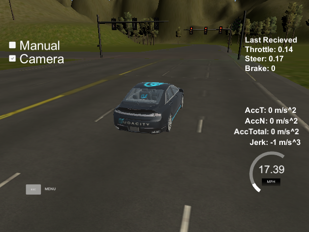

# Self driving car system integration project
## Implemented by Team Rushers

# Objective

The objective of the project is to build a self driving car by controlling its throttle, steering and brakes to navigate on a map. The car is equiped with numerous sensors (Lidar, Radar, cameras, etc) that we can access to make it aware of its environment. It is expected to follow lanes, detect traffic lights and objects and plan a trajectory based on pre-set waypoints. It should be able to classify “Red”, “Green”, and “Yellow” lights and stop/start/slow down based on the traffic signal.

Before running our program on Carla (Udacity's self driving car) we developed our code to work in a simulator. Even though simplified, it was able to let us quickly test our code without having access to the actual car and sensors. The simulator works in a very similar way as CARLA with communication performed through ROS nodes and topics. After having optimized our code and our controls in the simulator, we calibrated our commands based on Carla's specifications to see how it would perform on a real car.

Results to follow.

# Team

• Boris Dayma, Team Lead

• Chris Ferone

• Taiki Nishime

• Pabasara Karunanayake

• Ayanangshu Das

# General system architecture

The diagram below illustrates the system architecture. The autonomous vehicle controller is composed of three major units: perception, planning, and control.

The system architecture consists of the following modules described in the next sections.

## Perception
The existing localization module was based on radar and lidar data measurements and provided the current position, orientation and speed of the vehicle.

We developed a deep neural net to detect upcoming traffic lights as well as their color. We decided to use [a transfer learning approach](https://arxiv.org/pdf/1310.1531v1.pdf) based on a [MobileNet architecture](https://arxiv.org/pdf/1704.04861.pdf) previously trained on the [ImageNet dataset](http://www.image-net.org/). The neural network was then retrained using images from the simulator or real images from previously recorded ROS bags. It was able to efficiently detect and classify traffic lights.

It is interesting to note that we detect the traffic light as well as identify its color within the same neural network. We don't need to first identify its position through a bounded box. Our only concern is actually only to know that there is a red or orange traffic light somewhere ahead of us, and that we need to slow down and come to a full stop at its position, already located in our map.

One of the main advantages of MobileNets is that they are efficient while using much less memory and computing power than traditional neural networks, having been developed mainly for embedded devices. It was particularly adapted for our application in which we need to process pictures very quickly. The architecture of MobileNet has been reproduced herebelow:

We cannot develop an efficient neural network without a good dataset. We developed two separate classifiers for the simulation and for the actual site. They were based on recorded videos from the cameras, extracted and classified manually. We then augmented our dataset with random cropping, scaling, adjustment of brightness.

Our classifer for simulation images was able to reach a test accuracy of 93.3% (on 744 test samples).

Our classifer for site images was able to reach a test accuracy of 87.5% (on 640 test samples).

These accuracies are very high but not sufficient to have a fully reliable detection without adding other mechanisms. We use an exponential moving average to consider previous images and increase the probability of confidence we detected correctly the traffic lights, even though it can add a small lag of a few 1/10th of seconds. This proved to be an efficient method for detecting reliably traffic lights through different conditions.

## Planning
The route to follow was provided as a list of waypoints. We developed a "waypoint updater" node whose purpose was to publish a list of n waypoints ahead of the vehicle position, with a target velocity.

This node uses the car position, current velocity, list of waypoints from the track, as well as our traffic light classifier in order to plan for the upcoming path and target speeds to follow. It is set so that it can anticipate our general path for the upcoming few seconds (5-10 seconds is enough) in order to have smooth transitions between states (accelerating, slowing down, stopping), minimizing acceleration and jerk for a comfortable ride.

## Control
The objective of the control module is to follow as close as possible our plan.

We adjust throttle, brake and steering according to the targets published by the waypoint follower (informed itself by the waypoint updater node).

Since throttle & brake commands cannot be directly extrapolated from our target speed, we use pid's to control them. Parameters of the pid's are adjusted so that we follow as closely as possible our targets. We ensure that we don't keep alternating between accelerating and braking by accepting some tolerances on the target speed.

The steering is controlled taking into consideration the characteristics of the car (steering ratio, extreme values, current speed, wheel base) in order to calculate our necessary direction angle.

Finally, we use low pass filters on all our commands to avoid noise and create smoother controls.

Braking command (in yellow) before low pass filter:

Braking command (in yellow) after low pass filter is much smoother:

Due to differences of control in the simulator and on the real car we adjust our control commands proportionnally based on the intended use.

# Operation

Different roslaunch files can be used with our system to adapt quickly to different environments. In particular, the following modes have been implemented:

* simulation mode, which can be used with the [Udacity simulator](https://github.com/udacity/CarND-Capstone/releases/).

* site mode, which can directly be used on Carla.

We tested our program in the simulator until we reached satisfying results.

The car was following its lane with great accuracy, stopping at red lights, and acted smoothly, both in terms of steering as well as acceleration and braking.

We decided to proceed with implementing our code on a real car.

# Results

Coming soon!!!

# Original Readme from [Udacity](https://github.com/udacity/CarND-Capstone)

This is the project repo for the final project of the Udacity Self-Driving Car Nanodegree: Programming a Real Self-Driving Car. For more information about the project, see the project introduction [here.](https://classroom.udacity.com/nanodegrees/nd013/parts/6047fe34-d93c-4f50-8336-b70ef10cb4b2/modules/e1a23b06-329a-4684-a717-ad476f0d8dff/lessons/462c933d-9f24-42d3-8bdc-a08a5fc866e4/concepts/5ab4b122-83e6-436d-850f-9f4d26627fd9)

## Native Installation

   * Be sure that your workstation is running Ubuntu 16.04 Xenial Xerus or Ubuntu 14.04 Trusty Tahir. [Ubuntu downloads can be found     here.](https://www.ubuntu.com/download/desktop)

   * If using a Virtual Machine to install Ubuntu, use the following configuration as minimum:
      * 2 CPU
      * 2 GB system memory
      * 25 GB of free hard drive space
     The Udacity provided virtual machine has ROS and Dataspeed DBW already installed, so you can skip the next two steps if you are using this.

   * Follow these instructions to install ROS

     * [ROS Kinetic](http://wiki.ros.org/kinetic/Installation/Ubuntu) if you have Ubuntu 16.04.
     * [ROS Indigo](http://wiki.ros.org/indigo/Installation/Ubuntu) if you have Ubuntu 14.04.

   * [Dataspeed DBW](https://bitbucket.org/DataspeedInc/dbw_mkz_ros)

     * Use this option to install the SDK on a workstation that already has ROS installed: [One Line SDK Install (binary)](https://bitbucket.org/DataspeedInc/dbw_mkz_ros/src/81e63fcc335d7b64139d7482017d6a97b405e250/ROS_SETUP.md?fileviewer=file-view-default)

   * [Download the Udacity Simulator](https://github.com/udacity/CarND-Capstone/releases).

## Docker Installation

[Install Docker](https://docs.docker.com/engine/installation/)

Build the docker container

    Docker build . -t capstone

Run the docker file

    docker run -p 4567:4567 -v $PWD:/capstone -v /tmp/log:/root/.ros/ --rm -it capstone

## Usage

Clone the project repository

    git clone https://github.com/udacity/CarND-Capstone.git

Install python dependencies

    cd CarND-Capstone
    pip install -r requirements.txt
    
Make and run styx

    cd ros
    catkin_make
    source devel/setup.sh
    roslaunch launch/styx.launch
    
Run the simulator

## Real world testing

A. Download [training bag](https://drive.google.com/file/d/0B2_h37bMVw3iYkdJTlRSUlJIamM/view?usp=sharing) that was recorded on the Udacity self-driving car (a bag demonstraing the correct predictions in autonomous mode can be found [here](https://drive.google.com/open?id=0B2_h37bMVw3iT0ZEdlF4N01QbHc))

B. Unzip the file

    unzip traffic_light_bag_files.zip
    
C. Play the bag file

    rosbag play -l traffic_light_bag_files/loop_with_traffic_light.bag
    
D. Launch your project in site mode

    cd CarND-Capstone/ros
    roslaunch launch/site.launch
    
E. Confirm that traffic light detection works on real life images
